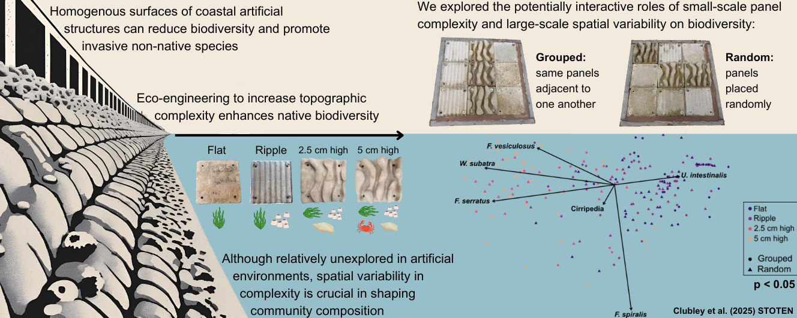

# Scaling up eco-engineering: the role of topographic complexity and spatial variability in shaping biodiversity on coastal structures

### Repository contains the data and code used to carry out the analysis and generate the figures and tables in the paper.

*Graphical abstract of the manuscript*
